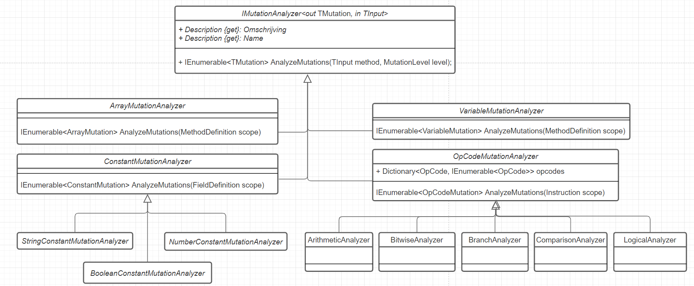

# Analyzers

An `analyzer` looks at the bytecode, checks what kind of mutations can take place, 
and returns the possible mutations (see next section) to the caller.

 
An analyzer has two generics: `TMutation` and `TInput`. 
`TMutation` is the mutation type which contains metadata about the possible mutation and can execute and/or undo itself. 
`TInput` is the scope where the mutation check will be made. 

The scope is a type of `Mono.Cecil` and can for example be a `Method/FieldDefinition` or `Instruction`.

- In the case of opcode mutations, the scope is an 'Instruction' (e.g. return 1 + 1) , 
- in the case of an array mutation, the scope is an integer 'Method Definition',
- in the case of a constant field mutation, the scope is a 'FieldDefinition'.

## OpCode Mutation Analyzer
This mutation analyzer looks at what possible mutations there are in the opcode of an instruction. 
An instruction is a statement like 'a = 1 + 2'. 
On this instruction the '+' can be changed to '-, /, *, %'. 
There are 4 different opcode mutation analyzers. 
Namely an analyzer for arithmetic operations (/, *), bitwise operations (^, |), branch (if) operations and comparison operations (<, >). 
For many opcodes, one or more mutations are possible, therefore an 'IEnumerable<TMutation>' is returned.

**Edge Case Comparison Operators**

There are many paths leading to Rome. This is the same for comparing values in IL-Code. 
This is demonstrated in the following list with the branching comparison variant and the comparison only variant (see Wikipedia for their meaning).
- **blt:** The effect is identical to performing a **clt** instruction followed by a **brtrue** branch to the specific target instruction.
- **bgt:** The effect is identical to performing a **cgt** instruction followed by a **brtrue** branch to the specific target instruction
- **bge:** The effect is identical to performing a **clt** instruction (clt.un for floats) followed by a **brfalse** branch to the specific target instruction.
- **beq:** The effect is the same as performing a **ceq** instruction followed by a **brtrue** branch to the specific target instruction.

It turns out that the compiler will usually optimize control flow by translating a boolean operator like ‘<’ into its IL complement branching instruction (clt). 
Hence it can be the case that different compilers generate different IL-code.
My compiler will always generate the comparison operator (clt) however on another PC it might as well use the branching variant (blt). 
This scenario might confuse one if certain mutations don't seem to be working. This Microsoft article goes into this issue deeper.

Faultify supports any mapping. For testing purposes there is a [utility](https://github.com/Faultify/Faultify/blob/main/Faultify.Tests/UnitTests/Utils/ConditionalBranchGenerator.cs) written 
that is able to force the branching or comparison variant.

### Constant Mutation Analyzer
This mutation analyzer looks at what possible mutations can be performed on a constant field. 
There are different types of constant fields with different ways of mutation. 
An integer can be mutated with a random number, a string with a random string and a boolean should be inverted. 

### Array Mutation Analyzer
This mutation analyzer looks at the possible mutations on arrays in a method body. 
There are different arrays, different ways to declare and modify them. 
An array can be:

- Modified
- Emptied
- Resized

There are:
- Arrays passed as parameters
- Inline initialized arrays (`new {1, 2, 3 }`)
- Index initialized arrays 
- Index changes

### Variable Analyzer
The variable analyzer is able to mutate literal variables such as `false` to `true`, `1` to `2` etc.. 
