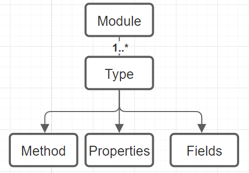
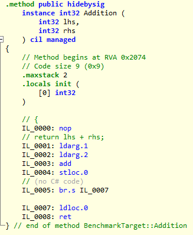
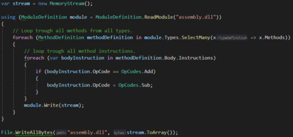

# Mutation Tesing

Fault Insertion, Fault Injection, Mutation Testing, Mutation Injection are terms that refer to the same subject. 
With mutation injection, one introduces changes to the logic of a codebase. 
If a logic mutation (change) is introduced and a test still succeeds then the test may not be fully reliable. 
This fact can be used to calculate determine the unit test quality.

# What Is a Mutation

A mutation is a change in operators, constant values, or variable declinations. Examples of possible mutations are:
- Arithmetic (+, -, /, *, %) Operators.
- Assignment Expressions (+=, -=, /=, *=, %=, — , ++).
- Equivalence Operators (==, !=).
- Logical Operators (&&, ||).
- Bitwise Operators (^,|, &).
- Branching Statements (if(condition), if(!condition)).
- Variable Literals (true, false).
- Mutate Constant Fields (string, number, boolean).

The operators above should be mutated to a variant that invalidates the logic. 
For example, a ‘+’ can be changed to a ‘-’, ‘<’ to a ‘>’, ‘true’ to a ‘false’ etc… 
With some types of mutations, it may be possible that the mutation results in the same value such as ‘1 + 1’ to ‘1*1’, 
therefore for these mutations all variants ‘+, -, *, /’ should be performed for the best result.

```csharp
// Original
public int Add(a, b) {
   return a + b;
}
// Mutation 1
public int Add(a, b) {
   return a - b;
}
// Mutation 2
public int Add(a, b) {
   return a * b;
}
```

## Infinite Loop Mutation

A mutation, such that you get ‘while(true)’, is able to cause an infinite loop.
This is an issue because it will cause the test session to run infinitely. 
This can be tackled in several ways:
1. An initial test run is performed to calculate the run time of all unit tests without mutations, then this metric is used as a process timeout value.
2. Before the test run is performed, it is validated whether a mutation can cause an infinite loop. 
This is a faster solution because you do not have to interrupt a test process and start it again if an infinite loop mutation occurs.
However, this can be very difficult to detect in advance for the following reasons:
   - A loop can contain many conditions that can potentially interrupt the loop using a return or break. All conditions have to be checked in order to know whether a mutation causes an infinite loop.
   - There can be various loops with different mutations. It is relatively easy to detect that a `while(false)` to `while(true)` mutation results in an infinite loop. However, this is way more difficult for a `while(a < b)` to a `while(a > b)` mutation.
    Besides infinite loops, pseudo-infinite is also an edge case that should be taken into account. A pseudo-infinite loop means that a loop takes some time to run however it is finite. The for loop mutation ‘++’ to ‘- -’ will flip the iteration direction which can take a long time (usually int.Max times) before it completes.

Next to an ordinary infinite loop there is also a possibility for infinite recursive calls to be created.
Though, those will be handled the same as time out mutations. 

# Mutation Technique
There are two main ways to mutate code logic:
- At the source code level (modifying syntax trees and compile the mutations)
- At the byte code level (modifying the byte code/CIL in the compiled assembly).

## Byte-code vs Source-code
I think that these two methods both have advantages as disadvantages. 
And that they are both valid ways to implement mutation testing. 
I did some Benchmark on a small project, both Stryker and Faultify seem to be performing equally well.
Though there is still optimizing work to be done for Faultify.

### Sourcecode with Mutation Switching:
**Pros:**
- Recompilation is not required when using mutant switching though this implies that for any new mutations or edits to current mutations the entire assembly is to be recompiled.
- The exact mutation location/line can be shown to users.
- Mutation coverage can be easily calculated.
- Its easier to run mutation test runs in parallel compared to byte-code.

**Cons**
- Control over individual mutations is limited since mutations can not be injected without recompilation at runtime.
- Constant, Method Names, Access modifiers mutations are impossible.
- With some mutations compile errors can be generated.

### Byte-Code
**Pros:**
- Recompilation is not required.
- Integrates with all .NET languages working on CIL.
- More flexibility and control over mutations since mutations can be injected without recompilation at runtime.
- Constant, Method Names, Access modifiers mutations are possible.
- Detailed control since only required mutations can be injected; This is useful when inspecting it with ‘ILSPY’ of ‘DNSPY’.
- There is a lot of flexibility in having access to IL-code.

**Cons**
- It is more difficult (not impossible) to show the exact mutation location/line since IL-code does not have code-lines.
- Some mutations like array mutations require complex IL-structures.
- It's more difficult (not impossible) to run mutation test runs in parallel compared to source-code.
- Calculating code coverage for individual mutations is next to impossible, therefore something like method-based coverage is sued in Faultify.

## Source Code Mutations

This technique modifies source code and compiles mutations into the binary. 
This is often accomplished with the C# syntax tree.

### Mutation Switching

If mutations are performed at the source code level then the code must be compiled to a binary before the test can be run with those mutations. 
In a large codebase, there can easily be thousands of mutations. 
If the source code is to be recompiled for each mutation the process will become extremely slow.
Therefore, the source code technique is often used with ‘Mutation Switching’/’Mutant schemata’. 
In short, this means that all mutations are compiled into the binary. The test process will then turn the mutations on or off with, for example, an environment variable. 
This is an example of how a ‘+’ is mutated to a ‘-’ and ‘*’ looks like:

```csharp
public int Add(int a, int b) {
   if (Environment.GetEnvironmentVariable("ActiveMutant") == 0) { 
     return a - b;
   } else { 
     return a * b;        
   } 
}
```
Thus, the test process can set the ‘ActiveMutant’ environment variable to ‘0’ to execute the ‘-’ and to 1 for ‘*’.

## Byte Code Mutations
The advantage of byte code manipulation is that the mutated source code does not need to be recompiled and not all mutations need to be injected ahead of time. For Faultify we use ‘Mono.Cecil’. This is an excellent library for manipulating ‘IL-CODE (CIL)’. A major drawback I have encountered is that the library is very poorly documented which makes it difficult to get started.
‘Mono.Cecil’ is made up of the following structure:



A module is a compiled assembly, the types are classes for example, and these classes have methods, properties, and fields. 
On these levels, as described earlier, mutations can be performed.
Let’s mutate the following method:

```csharp
public int Addition(int lhs, int rhs)
{
    return lhs + rhs;
}
```

## Code Mutation Example




You can see the IL code of the ‘Addition’ method inspected with ‘Il-Spy’.
Instruction IL_0003 has the ‘add’ opcode. If we change this to ‘sub’ then the operation here becomes a subtraction instead of addition (dn-spy can be used for editing IL-code manually). 
The following image shows the ‘add’ to ‘sub’ motion with ‘Mono.Cecil’:



Here you can see that a `ModuleDefinition` has many `TypeDefinitions` and that the type has many `MethodDefinitions` who on its turn has `Instructions`. 
We want to mutate the ‘add’ opcode to ‘sub’ opcode.

For an extensive view on the meaning and edge cases of opcodes checkout the [Wikipedia](https://en.wikipedia.org/wiki/List_of_CIL_instructions) and [Microsoft](https://docs.microsoft.com/en-us/dotnet/api/system.reflection.emit.opcodes.bgt?view=net-5.0) pages.

**Edge Case Comparison Operators**

There are many paths leading to Rome. This is the same for comparing values in IL-Code. 
This is demonstrated in the following list with the branching comparison variant and the comparison only variant (see Wikipedia for their meaning).
- **blt:** The effect is identical to performing a **clt** instruction followed by a **brtrue** branch to the specific target instruction.
- **bgt:** The effect is identical to performing a **cgt** instruction followed by a **brtrue** branch to the specific target instruction
- **bge:** The effect is identical to performing a **clt** instruction (clt.un for floats) followed by a **brfalse** branch to the specific target instruction.
- **beq:** The effect is the same as performing a **ceq** instruction followed by a **brtrue** branch to the specific target instruction.

It turns out that the compiler will usually optimize control flow by translating a boolean operator like ‘<’ into its IL complement branching instruction (clt). 
Hence it can be the case that different compilers generate different IL-code.
My compiler will always generate the comparison operator (clt) however on another PC it might as well use the branching variant (blt). 
This scenario might confuse one if certain mutations don't seem to be working. This Microsoft article goes into this issue deeper.

Faultify supports any mapping and will handle this edge-case. 
For testing purposes there is a [utility](https://github.com/Faultify/Faultify/blob/main/Faultify.Tests/UnitTests/Utils/ConditionalBranchGenerator.cs) written 
that is able to force the branching or comparison variant.


