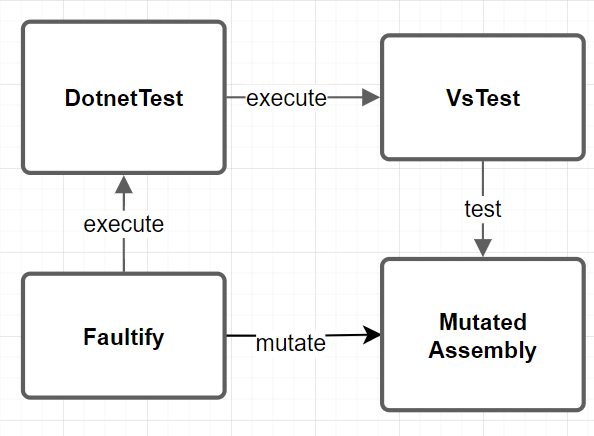
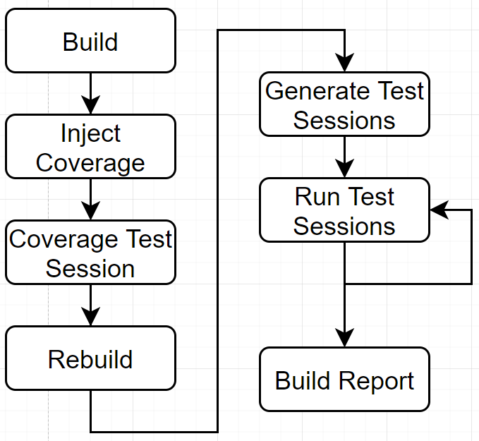
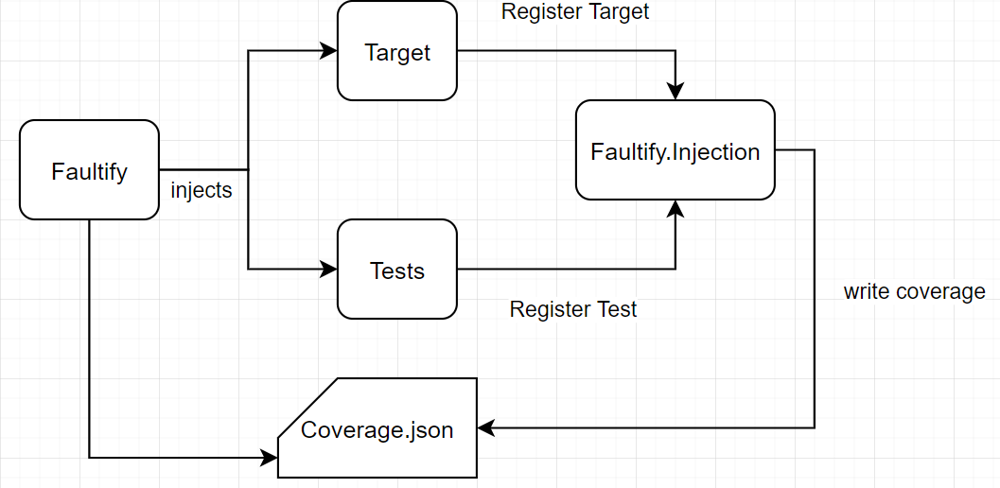

## Test Process Overview

**The main test process overview looks like this:**

**The test process from Faultily looks like this:**

1. **Build:** This is the initial project build to determine if the project compiles and make sure all assemblies are on their place. 
2. **Inject Coverage:** Here the test coverage functions are injected. 
3. **Coverage Test Session:** This initial test session determines: 1) Which tests cover what mutations 2) Test duration used for the real test runs.
4. **Rebuild:** Rebuilds the project to remove all injected test code.
5. **Generate Test Session:** Generate the test runs and binpack the testruns to run multiple mutations at once.
6. **Run Test Sessions:** Run the test sessions in serial (un the future this will be parallel).
7. **Generate Report:** Generate a report from all test results.

## Optimisation
Dotnet test is used for executing tests.
Dotnet test has a process startup/shutdown overhead time of about 1 second. 
For example, take 2000 mutations, this will take 2000 seconds (33 minutes) for the process management only. 
Therefore optimizations are essential for a well-functioning mutation tool.

Faultily Has Implemented:
- Mutation Bin Packing
- Mutation Levels
- Run Mutations in Parallel

Faultily Will Support:
- Memory Mapped Files

**Run Tests from Memory**

‘dotnet test’ is a wrapper over ‘vs-test-console’ which are both external processes. 
In an ideal scenario, you would want to be able to load unit tests into memory and then run them from code. 
This can save about 1 second per test run. As far I was able to find out vsconsole can only be used as an external process (`VsConsoleWrapper`).
However, it might be possible for Nunit to be run directly from code. 
Though that will limit the support for other test frameworks. 

**Memory Mapped Files and or Ramdisk**

Memory-mapped files (a really amazing undervalued technique) and/or a ramdisk makes use of RAM memory allowing for very fast file reading/writing. 
The ramdisk can be used to run the entire test process and the memory-mapped files can be used for the assemblies under mutation.

**Mutation Bin Packing**

A mutation can cause a test to fail or to succeed, so it is impossible to mutate two mutations that are covered by a test at the same time. 
If you did, there is no way to tell which mutation caused the test to fail. This scenario is a perfect bin-packing problem. 
The test is the bin and the mutation is the packet. Each test can have only one mutation at a time and you can run one test within a test session. 
Following that algorithm, multiple mutations can be performed at the same time.
In order to implement this algorithm, one has to measure code coverage.

**Run Mutations in Parallel**

An assembly is mutated and the tests have a reference to this assembly. 
It is not possible to run multiple test sessions because they would mutate the same assembly. 
In addition, the CLR locks the assemblies of a test process. 
To use multiple processes, the tests and assemblies under test should be duplicated so that each test process has its own assembly files. 
Thus, this implies that the number of threads is equal to the number of duplications of the binaries.

**Mutation Level**

With some types of mutations, it may be possible that the mutation results in the same value such as ‘1 + 1’ to ‘1*1’, 
therefore for these mutations all variants ‘+, -, *, /’ should be performed for the best result.
Though for large projects testing all variants is time consuming and maybe not worth it. 
Therefore the test session could use mutation levels like: Detailed, Medium, Simple to indicate which depth to use for testintg.

## Coverage

Faultify measures code coverage by injecting a static register function in both the unit test and all methods from the assembly under test. 
When the code coverage test run is performed those static functions are called. First, the unit test that runs registers its name after that all methods called by this unit test will register their ‘Entity Handle’. After this run, we can exactly see what unit tests covered which methods. 
Difficulties are:
- Since unit tests can cover code behind interfaces it's impossible to use reflection to test code coverage.
- To know whether a mutation is covered we need to somehow identify this mutation. We had complications doing so, instead, we register only the method entity handle. 
This entails that test coverage is method based not mutation-based which implies that more mutations will be performed.

  

When running the test process the code will do something like the following:
1. Run Unit Test
2. Register name from unit test
3. Run method that is tested by unit test.
4. Register method name.

Those results are written to: `coverage.json`.
At the end of the test process this data is used by faultify to binpack the tests with mutations (see above).  

## DataCollector
The test data collectors are used to handle events from the test host.
With those events Faultify can do useful things. 

- `TestDataCollector`: Collects the test status from running tests and writes them to `test_results.json`.
- `CoverageDataCollector`: Filters the `coverage.json` such that only the tests it saw will remain in the file.  
